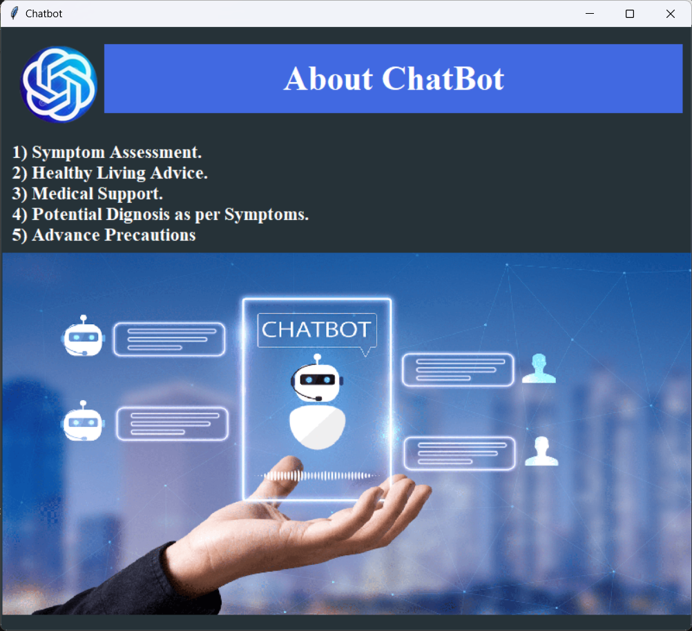

# **Healthcare Chatbot**
<div align="center">
    
</div>

---

## **Description**
The Healthcare Chatbot is an intelligent desktop-based application designed to assist users in identifying potential health conditions based on their symptoms. It leverages machine learning models and OpenAI's GPT for providing insightful responses and suggestions. The project uses Tkinter for the graphical user interface and various Python libraries for data handling and processing.

---

## **Features**
- Interactive chatbot interface.
- Symptom-based health condition prediction.
- OpenAI-powered natural language processing for responses.
- Integration of decision tree and SVM (Support Vector Machine) for accurate predictions.
- User-friendly GUI with Tkinter.

---

## **Technologies Used**
- **Programming Language**: Python
- **Libraries**:
  - Tkinter (GUI)
  - pandas and numpy (data handling)
  - scikit-learn (machine learning)
  - Pillow (image processing)
  - OpenAI API (chat response generation)

---

## **Installation**

### **Prerequisites**
- Python 3.x installed on your system.
- API key for OpenAI (store securely as an environment variable `OPENAI_API_KEY`).

### **Steps**
1. Clone the repository:
   ```bash
   git clone https://github.com/Wani-Chetan-999/Healthcare_Chatbot.git
   cd Healthcare_Chatbot
   ```

2. Install the required Python dependencies:
   ```bash
   pip install -r requirements.txt
   ```

3. Set up your OpenAI API Key as an environment variable:
   - On **Windows**:
     ```cmd
     set OPENAI_API_KEY=your_openai_api_key
     ```
   - On **macOS/Linux**:
     ```bash
     export OPENAI_API_KEY=your_openai_api_key
     ```

4. Run the application:
   ```bash
   python main.py
   ```

---

## **Usage**
- Launch the chatbot by running the `main.py` file.
- Enter symptoms to get potential health condition predictions.
- Chat with the bot for additional insights or health tips.

---

## **Project Structure**
```
Healthcare_Chatbot/
│
├── main.py                 # Main application script
├── bot.py                  # Contains chatbot logic
├── gptBot.py               # Integration with OpenAI's GPT
├── askBot.py               # Self Developed Prediction Module
├── about.py                # Abot Project
├── requirements.txt        # List of dependencies
├── README.md               # Project documentation
├── /__pycache__/           # Compiled Python files (ignored by Git)
└── /data/                  # CSV files for symptoms and conditions
```

---

## **Machine Learning Models**
- **Decision Tree Classifier**: Predicts health conditions based on symptoms.
- **Support Vector Machine (SVM)**: Enhances accuracy by leveraging classification capabilities.

---

## **Screenshots**
### Chatbot Interface


### Health Prediction Screen


### Health Prediction Screen


### Health Prediction Screen


### Health Prediction Screen


chatbot.png
---

## **Contributing**
Contributions are welcome! To contribute:
1. Fork the repository.
2. Create a feature branch:
   ```bash
   git checkout -b feature-name
   ```
3. Commit your changes and push them to your fork.
4. Open a pull request.

---

## **License**
This project is licensed under the MIT License. See the [LICENSE](LICENSE) file for details.

---

## **Acknowledgments**
- [OpenAI](https://openai.com/) for providing GPT API.
- [Scikit-learn](https://scikit-learn.org/) for machine learning tools.
- Python community for amazing libraries and resources.

---

Let me know if you'd like to customize any sections further!
